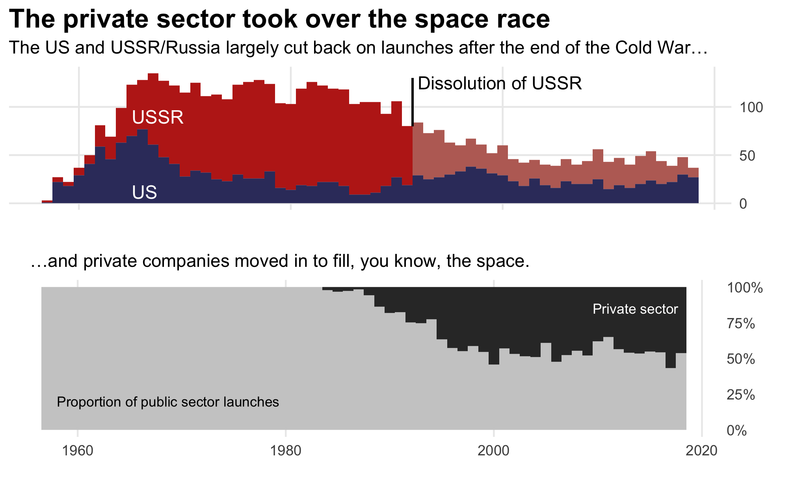

# Tidy Tuesday, 1/16/19

One of my goals for this year is to *do* more, meaning "learn" less through reading, doing tutorials, etc., and really learn things by actually getting in there and working through projects. To that end, I'm hoping to do more of these #TidyTuesday exercises to hone my data, viz, and R chops.

This week, after doing a little EDA, I hit on the idea of pairing the growth in private sector space exploration with the end of the Cold War. I took the opportunity to experiment a bit with `gridextra` to lay out multiple plots, and also to add a bunch of annotations. I also tried to be more intentional about my use of color.

Going forward, in addition to building on what I've started working on so far, I hope to add more attention to typography, and explore new plot types.
